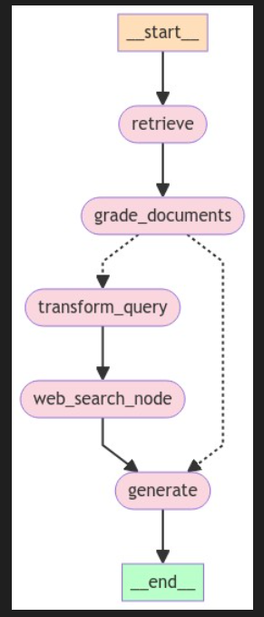

# CRAG

Corrective-RAG (CRAG) is a strategy for RAG that incorporates self-reflection / self-grading on retrieved documents.

Here in this project, I have built a CRAG model using LangGraph, Tavily Search API and ChatFireworks API.

### Workflow:
* Upload your pdf files.
* They will be converted into embeddings using GPT4Embeddings(model_name="all-MiniLM-L6-v2.gguf2.f16.gguf") and will be stored in Chroma vectordatabase.
* The user will ask a quetion.
* The relevant documents are retrieved.
* The documents are graded as "yes" that are relevant to the question or "no" not relevant to the question using the LLM of ChatFireworks.
* If "yes" the documents are then used for final generation of the output.
* If "no",the question will be transformed and the tavily search api is used to extract relevant data from the internet. 
* The final output will be generated using the extracted documents from the internet.

The final model contains 6 main nodes as shown in the figure.

#### API's used
* Fireworks API
* Tavily Search API

 

